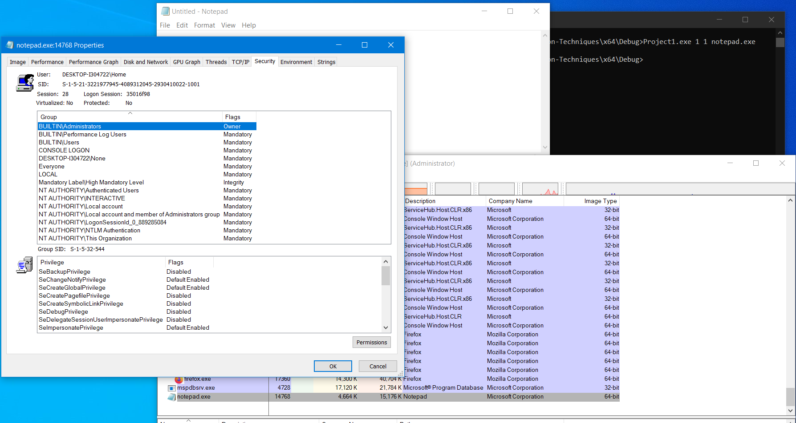

# Windows-Privilege-Escalation-Techniques

## Overview

Demo 2 privilege escalation techniques via UAC bypass:
* Computer Defaults Hijacking: hijack into `ComputerDefaults.exe` for elevated rights executing.
* System Properties Advanced Hijacking: hijack into `SystemPropertiesAdvanced.exe` (SysWOW64) for elevated rights executing.

This project also supports install and uninstall option for each above techiques.

## How to build?

* Clone the repository
* Open solution with Visual Studio and build it (x86 | x64)

## Usage

`Project1.exe [method] [mode] [command]`:
 
* method: 1 (Computer Defaults Hijacking) or 2 (System Properties Advanced Hijacking)

* mode: 1 (install) 2 (uninstall)

* command: your command

Demo

